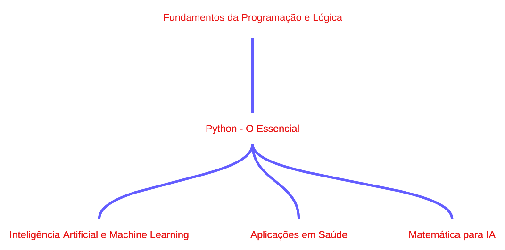

# Mind-Field
Private research codebase.

# Documentação de Estudos - Trajetória em IA

Este repositório documenta minha jornada de estudos em Inteligência Artificial, com foco na aplicação na área da saúde. Aqui você encontrará:

- Materiais de estudo.
- Projetos desenvolvidos.
- Anotações importantes sobre lógica de programação, Python e Inteligência Artificial.

## Trajetória de Estudos

Abaixo está o diagrama que representa a trajetória planejada para alcançar os objetivos:

## Estrutura do Repositório

- `notebooks/`: Notebooks Jupyter com implementações e estudos.
- `projetos/`: Projetos práticos aplicados à área da saúde.
- `docs/`: Documentação detalhada dos estudos.

## Objetivo Final

Adquirir conhecimentos sólidos em IA para área da saúde.

## ATENÇÃO

Faça a instalação do VSCode e em seguida instale o python em seu computador.

## Fontes

- [CS50x - Introdução à Ciência da Computação (Harvard)](https://cs50.harvard.edu/x/2025).
- Livro: "Lógica de Programação e Algoritmos com Python" (versão PDF gratuita disponível online).
- [Python.org - Documentação Oficial.](https://docs.python.org/pt-br/3/).
- [Curso de Python - Solyd.](https://solyd.com.br/cursos/python-basico/).
- Livro: "Matemática para Machine Learning" (PDF gratuito disponível online).
- [Khan Academy - Matemática Avançada.](https://pt.khanacademy.org/).
- [Coursera - Machine Learning (Andrew Ng).](https://www.coursera.org/learn/machine-learning).
- [Coursera - DeepLearning.AI TensorFlow.](https://www.coursera.org/professional-certificates/tensorflow-in-practice).
- [Fast.ai - Curso Gratuito de Deep Learning.](https://www.fast.ai/).
- Artigos científicos (PubMed, ArXiv).
- [Kaggle - Conjuntos de Dados Médicos.](https://www.kaggle.com/).

---

*Documentação mantida por [Felipe Breseghello](https://github.com/fbreseghello).*
